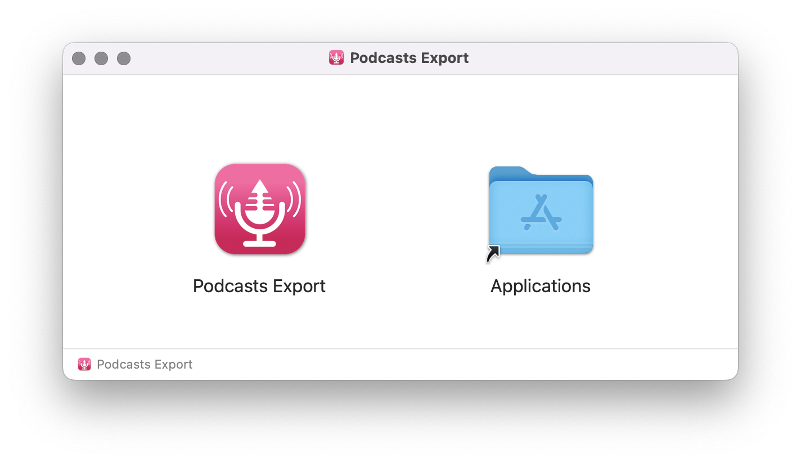
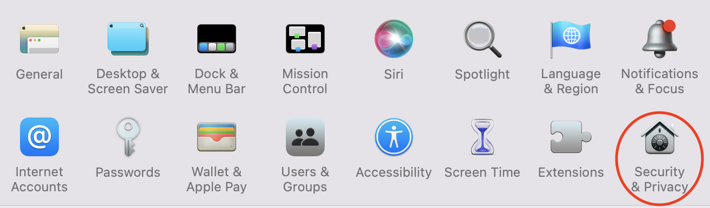
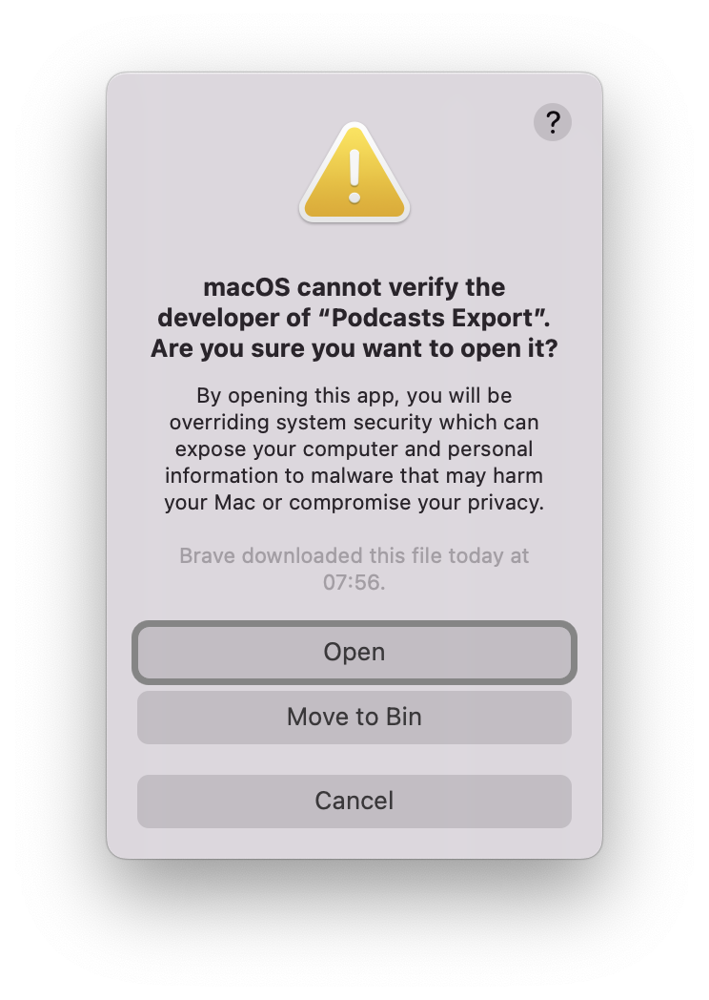

Podcasts Export App
===================

Douglas Watson, 2022, MIT License

A macOS app that exports apple podcasts to a folder, for later use on a portable mp3 player.

[Download here](https://github.com/douglas-watson/podcasts_export_app/releases/download/v1.0.0/PodcastsExport.dmg)

Following the creation of my [automator script](https://github.com/douglas-watson/podcasts_export), many people struggled to install or use it, due to python dependencies. This project is an attempt to help those people by distributing a proper app. If all goes well, it should install like any other macOS app.

Installing
----------

Download the [dmg](https://github.com/douglas-watson/podcasts_export_app/releases/download/v1.0.0/PodcastsExport.dmg). Open it, and drag the app to your Applications folder:

Since I am not a registered Apple developer, you will have to explicitely trust this app. **When you first open the app, nothing happens** as macOS blocks unregistered apps. 

Go to System Prefences > Security & Privacy:

You should see a message warning that I am not a registered developer. Click **Open Anyway**:

You may need to confirm a second time:

🎆 New features 🎆
-----------------

Compared to the automator script, this app allows you to select which downloaded episodes to export. Helpful for large collections.

This one is launched like a regular app, it is no longer registered as a service available from Podcasts.

Developing
----------

Create a virtual env or conda environment, and install requirements with:

    pip install -r requirements.txt

Building
--------

Build a mac app with:

    ./build.sh

Before distributing, create a disk image with:

    ./build.sh dmg